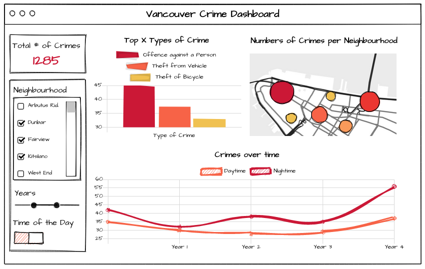

Crime in Vancouver Dashboard Proposal
================

## Motivation and Purpose
Our role: Data science team in the Vancouver Police Department
Target audience: Newcomers to Vancouver looking for places to live
 
Safety is an important factor for consideration when choosing a place to live. Vancouver is a major destination city for immigrants from all over the world and Canadians looking to relocate within Canada. Our team wants to create a dashboard that visualizes crime data in Vancouver and potentially help newcomers decide where to move to, depending on how safe certain neighborhoods are. In addition, we want to provide general information, such as trends in crimes in Vancouver for the past five years and the number of crimes at different times of day, to increase newcomers' understanding of public safety and crime in Vancouver as a whole as they make their decision to relocate.

## Description of the data
The dataset includes 32,012 reported crime cases in Vancouver from January 2017 to December 2021. Each record has 10 associated variables that describe the type of the crime (TYPE), the reported time when the crime occurred (YEAR, MONTH, DAY, HOUR, MINUTE), the location of the reported crime (HUNDRED_BLOCK, NEIGHBOURHOOD), and projected coordinate values in UTM Zone 10 (X, Y). 

## Research questions and usage scenarios
Melisa is deciding whether she should move to Vancouver with her family. As someone new to Vancouver, she doesn't know which neighborhood to live in if she decides to move. First, she looks at the trends of total number of crimes in Vancouver and she can filter this data by daytime or nighttime and she realizes that even though Vancouver's total number of crimes have gone up in the past five years, it is still lower than where she lives now, so she proceeds with [exploring] different neighborhoods. She finds certain neighborhoods have become safer in the past five years in terms of the total number of crimes using the filter for years. She then [drills down] to look at the types of crimes in the safer neighborhoods using the neighborhoods filter in the dashboard and [identify] neighborhoods that only have petty crimes or misdemeanors which shouldn't pose danger to her and her family. She makes a list of the neighborhoods she deems worth visiting and starts looking at houses in those neighborhoods after using our dashboard.

## Description of the app and the sketch
insert paragraph

